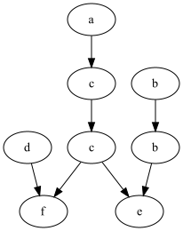
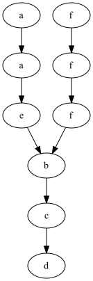

# Temat: Teoria współbierzności - zadanie domowe 1 - Dependency Graph
- - -
# Autor: Dariusz Cebula
- - - 

## 1. Format:

Program został napisany w javie (ver 17), kompilacja w Gradle

## 2. Uruchomienie programu:

W folderze głównym aplikacji wystarczy wywołać

```
./gradlew run
```

może być wymagane prawo do wykonania, wtedy

```
chmod +x gradlew
```

Pliki wejściowe w formacie `.txt` należy dać do folderu `src/main/resources/inputFiles`. Format pliku poniżej

## 3. Działanie programu:

Program na wejściu wczytuje wszystkie pliki `.txt` w folderze `src/main/resources/inputFiles`

### Format pliku txt:

Przykład:

```text
(a) x := x + 1
(b) y := y + 2z
(c) x := 3x + z
(d) w := w + v
(e) z := y - z
(f) v := x + v
A = {a, b, c, d, e, f}
w = acdcfbbe
```

### Poszczególne kroki programu:

1. Oblicza zbiór zależności i niezależności na podstawie podanych transakcji
2. Na podstawie zbioru zależności i podanego słowa `w` wyznacza graf zależności 
3. Na podstawie grafu zależności wyznacza postać normalną Foaty `FNF`

### Output:

Program zwraca wyniki dla każdego pliku `.txt`. W folderze `src/main/resources/outputResults` tworzy dla 
każdego pliku osobny folder wynikowy.

1. Tworzy plik `.txt`

Przykład:

```text
D = [[a, a], [a, c], [a, f], [b, b], [b, e], [c, a], [c, c], [c, e], [c, f], [d, d], [d, f], [e, b], [e, c], [e, e], [f, a], [f, c], [f, d], [f, f]]
I = [[a, b], [a, d], [a, e], [b, a], [b, c], [b, d], [b, f], [c, b], [c, d], [d, a], [d, b], [d, c], [d, e], [e, a], [e, d], [e, f], [f, b], [f, e]]
FNF([w]) = [[a, d, b], [c, b], [c], [f, e]]
digraph g {
0 -> 1
1 -> 3
2 -> 4
3 -> 4
3 -> 7
5 -> 6
6 -> 7
0[label=a]
1[label=c]
2[label=d]
3[label=c]
4[label=f]
5[label=b]
6[label=b]
7[label=e]
}
```

gdzie:

- W pierwszej linii `D` oznacza zbiór zależności,
- W drugiej linii `I` oznacza zbiór niezależności,
- W trzeciej linii `FNF([w])` oznacza postać normalną Foaty. Gdzie każda lista oznacza kolejną grupę,
- Następnie graf zależności w formacie `.dot`

2. Tworzy plik `.dot` z grafem zależności

Przykład:

```
digraph g {
0 -> 1
1 -> 3
2 -> 4
3 -> 4
3 -> 7
5 -> 6
6 -> 7
0[label=a]
1[label=c]
2[label=d]
3[label=c]
4[label=f]
5[label=b]
6[label=b]
7[label=e]
}
```

3. Tworzy plik `.png` z grafem zależności

Przykład:



4. Wypisuje wyniki w konsoli.

## 4. Wynik wywołania programu dla przykładowych danych

### Dane testowe 1

```
(a) x := x + 1
(b) y := y + 2z
(c) x := 3x + z
(d) w := w + v
(e) z := y - z
(f) v := x + v
A = {a, b, c, d, e, f}
w = acdcfbbe
```

Wyniki:

```
D = [[a, a], [a, c], [a, f], [b, b], [b, e], [c, a], [c, c], [c, e], [c, f], [d, d], [d, f], [e, b], [e, c], [e, e], [f, a], [f, c], [f, d], [f, f]]
I = [[a, b], [a, d], [a, e], [b, a], [b, c], [b, d], [b, f], [c, b], [c, d], [d, a], [d, b], [d, c], [d, e], [e, a], [e, d], [e, f], [f, b], [f, e]]
FNF([w]) = [[a, d, b], [c, b], [c], [f, e]]
digraph g {
0 -> 1
1 -> 3
2 -> 4
3 -> 4
3 -> 7
5 -> 6
6 -> 7
0[label=a]
1[label=c]
2[label=d]
3[label=c]
4[label=f]
5[label=b]
6[label=b]
7[label=e]
}
```


### Dane testowe 2

```
(a) x := x + y
(b) y := z - v
(c) z := v * x
(d) v := x + 2y
(e) x := 3y + 2x
(f) v := v - 2z
A = {a,b,c,d,e,f}
w = afaeffbcd
```

Wyniki:

```
D = [[a, a], [a, b], [a, c], [a, d], [a, e], [b, a], [b, b], [b, c], [b, d], [b, e], [b, f], [c, a], [c, b], [c, c], [c, d], [c, e], [c, f], [d, a], [d, b], [d, c], [d, d], [d, e], [d, f], [e, a], [e, b], [e, c], [e, d], [e, e], [f, b], [f, c], [f, d], [f, f]]
I = [[a, f], [e, f], [f, a], [f, e]]
FNF([w]) = [[a, f], [a, f], [e, f], [b], [c], [d]]
digraph g {
0 -> 2
1 -> 4
2 -> 3
3 -> 6
4 -> 5
5 -> 6
6 -> 7
7 -> 8
0[label=a]
1[label=f]
2[label=a]
3[label=e]
4[label=f]
5[label=f]
6[label=b]
7[label=c]
8[label=d]
}
```

